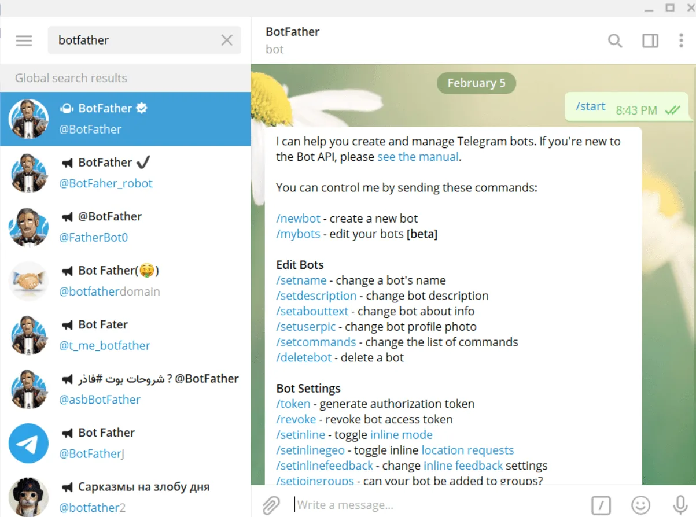
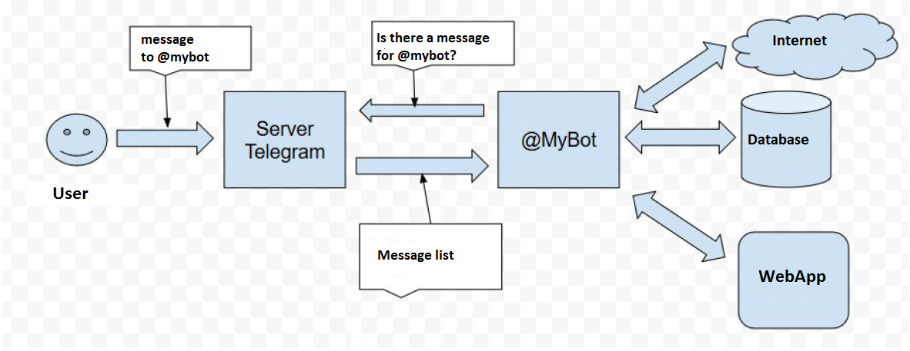

# Изучение технологии: Создание Telegram-бота на Node.js

## Введение

В рамках освоения современных веб-технологий и взаимодействия с внешними API мы поставили перед собой цель — **разобраться, как создавать Telegram-ботов с использованием Node.js**. Telegram — один из самых популярных мессенджеров, и боты в нём широко применяются в самых разных сферах: от клиентской поддержки до автоматизации задач и развлекательных сервисов.

Создание собственного Telegram-бота — это отличный способ углубиться в работу HTTP-протокола, научиться обрабатывать запросы, а также освоить структуру взаимодействия с внешними API. Для реализации проекта мы выбрали стек на базе Node.js, как один из наиболее доступных и гибких для разработки серверной логики.

---

## Что такое Telegram Bot API

Telegram предоставляет разработчикам **Bot API** — это набор HTTP-методов, позволяющий создавать ботов, которые могут получать и отправлять сообщения, управлять диалогами, реагировать на команды пользователей и использовать интерактивные элементы интерфейса (кнопки, меню и т.д.).

Ключевые возможности Telegram Bot API:
- **Отправка сообщений** пользователям, группам и каналам
- **Обработка входящих команд** и сообщений от пользователей
- **Inline-кнопки и кастомная клавиатура** для создания интерактивного интерфейса
- **Webhook-подключение** — приём запросов от Telegram в реальном времени

Bot API полностью построен на HTTP-запросах и возвращает данные в формате JSON. Это делает его простым для понимания, особенно для начинающих разработчиков, и позволяет использовать практически любой язык программирования, поддерживающий HTTP.

---

## Принцип работы Telegram-бота

Процесс взаимодействия с Telegram Bot API строится следующим образом:

1. **Пользователь отправляет сообщение боту** через Telegram-клиент.
2. **Telegram-сервер обрабатывает сообщение** и перенаправляет его на заранее настроенный URL, используя механизм `setWebhook`.
3. **Серверная часть (backend)**, написанная нами на Node.js, принимает это сообщение в формате JSON.
4. Программа анализирует полученные данные (например, текст команды или нажатие кнопки).
5. **Формируется ответ**, который отправляется обратно пользователю через POST-запрос к Telegram Bot API.

В качестве альтернативы Webhook можно использовать метод **long polling** — бот будет сам периодически опрашивать Telegram-серверы. Однако для целей обучения и дальнейшей масштабируемости мы решили сосредоточиться именно на Webhook, так как он быстрее и эффективнее.

---

## Используемый стек технологий

| Компонент       | Описание                                                                 |
|------------------|--------------------------------------------------------------------------|
| **Node.js**       | Среда выполнения JavaScript на сервере, подходящая для асинхронной работы. |
| **Express.js**    | Лёгкий веб-фреймворк для Node.js, позволяющий просто обрабатывать HTTP-запросы. |
| **Axios**         | HTTP-клиент, используемый для отправки POST-запросов к Telegram API.     |
| **body-parser**   | Middleware для обработки тела входящих запросов в формате JSON.          |
| **Telegram Bot API** | Внешний REST API для взаимодействия с пользователями Telegram через бота. |

Дополнительно был использован **ngrok** — инструмент, позволяющий создать публичный HTTPS-адрес для локального сервера. Это особенно полезно при тестировании Webhook, так как Telegram требует HTTPS-соединение.

---

## Как мы изучали технологию

Для того чтобы не просто повторить чужой код, а действительно **понять, как работает Telegram Bot API**, мы пошли поэтапно:

1. **Ознакомление с официальной документацией**  
   Начали с изучения [официального руководства Telegram Bot API](https://core.telegram.org/bots/api), чтобы понять, как устроены запросы, какие существуют методы и форматы ответов.

2. **Анализ примеров и туториалов**  
   Изучили ряд образовательных материалов, включая подробный [гид от Soham Kamani](https://www.sohamkamani.com/nodejs/telegram-bot/) и открытые проекты на GitHub. Это позволило увидеть разные подходы и стили реализации.

3. **Эксперименты с Webhook и polling**  
   Мы протестировали два способа получения сообщений — polling и Webhook. В итоге остановились на Webhook как на более эффективном для серверной архитектуры.

4. **Использование ngrok**  
   Так как Telegram требует HTTPS-адрес для Webhook, мы использовали [ngrok](https://ngrok.com/), чтобы пробросить наш локальный сервер в интернет. Это позволило легко тестировать бота без необходимости развертывать сервер в облаке.

5. **Создание прототипа бота**  
   В результате мы реализовали базового бота, который мог:
   - Отвечать на команды (`/start`, `/help`)
   - Отправлять текстовые сообщения в ответ
   - Работать с кнопками (inline keyboard)

---

## Вывод

Работа с Telegram Bot API на Node.js оказалась гораздо доступнее, чем ожидалось. Благодаря хорошо документированному API и удобным инструментам Node.js, создать полноценного Telegram-бота можно за несколько часов.

Мы поняли, как важно:
- грамотно обрабатывать HTTP-запросы и ответы,
- структурировать код бота для масштабируемости,
- учитывать особенности клиент-серверной архитектуры при работе с внешними API.

Кроме того, это отличный практический пример, как современные веб-технологии (Express, Axios, ngrok) работают вместе в реальных проектах.

В будущем на основе полученных знаний можно реализовать более сложных ботов — с авторизацией, базами данных, логикой принятия решений и интеграцией с внешними сервисами. Telegram-боты стали для нас отличной отправной точкой в изучении прикладной разработки и построении собственных сервисов.

---

## Полное руководство: Создаём первого Telegram-бота на Node.js (для начинающих)

В этом руководстве мы шаг за шагом создадим простого Telegram-бота, который будет повторять ваши сообщения. Всё будет разворачиваться на локальном компьютере — никаких сложных облачных сервисов!

---

## Подготовка: что вам понадобится

1. [Node.js](https://nodejs.org/) (версия 14 или новее)
2. Зарегистрируйте бота через [@BotFather](https://t.me/BotFather)
3. Текстовый редактор (VS Code, Sublime Text или любой другой)
4. Бесплатный инструмент ngrok (чтобы Telegram мог "достучаться" до вашего локального сервера)

---

## Шаг 1: Создаём бота в Telegram

1. Откройте Telegram и найдите @BotFather (это специальный бот для создания других ботов)

2. Отправьте ему команду ```/newbot```



Следуйте инструкциям:

1. Придумайте имя бота (например, ```MyEchoBot```)

2. Придумайте username бота (должен заканчиваться на ```bot```, например, ```MyEchoTestBot```)

3. В ответ BotFather пришлёт токен вашего бота. Он выглядит примерно так:
```
123456789:ABCdefGHIJKlmNOPQRstUVWXYz123456789
```
**Сохраните этот токен!** Он понадобится позже.

---

## Шаг 2: Настраиваем проект

1. Создайте папку для проекта, например:

```
mkdir my-telegram-bot
cd my-telegram-bot
```

2. Инициализируем Node.js проект:
```
npm init -y
```
3. Устанавливаем необходимые библиотеки:
```
npm install express axios body-parser
```

---

## Шаг 3: Пишем код бота

Создайте файл bot.js и добавьте следующий код:
```
const express = require('express');
const axios = require('axios');
const bodyParser = require('body-parser');

// Замените на ваш токен от BotFather
const TELEGRAM_TOKEN = 'ВАШ_ТОКЕН_БОТА';
const TELEGRAM_API = `https://api.telegram.org/bot${TELEGRAM_TOKEN}`;

// Создаём Express-приложение
const app = express();
app.use(bodyParser.json());

// Обработчик POST-запросов от Telegram
app.post('/', async (req, res) => {
  const chatId = req.body.message.chat.id;
  const text = req.body.message.text;

  console.log('Получено сообщение:', text);

  // Отправляем ответ (эхо-сообщение)
  await axios.post(`${TELEGRAM_API}/sendMessage`, {
    chat_id: chatId,
    text: `Вы сказали: "${text}"`
  });

  res.sendStatus(200);
});

// Запускаем сервер
const PORT = 3000;
app.listen(PORT, () => {
  console.log(`Сервер бота запущен на порту ${PORT}`);
});
```

---

## Шаг 4: Настраиваем ngrok для локального сервера

1. Скачайте ngrok с официального сайта

2. Распакуйте и запустите (или установите через npm: npm install -g ngrok)

3. В новом терминале выполните:
```
ngrok http 3000
```
4. Ngrok выдаст вам HTTPS-ссылку вида:
```
https://abcdef12.ngrok.io
```

Это публичный адрес вашего локального сервера.

---

## Шаг 5: Настраиваем Webhook в Telegram
1. Откройте новый терминал
2. Выполните команду (замените URL на ваш от ngrok):
```
curl -X POST "https://api.telegram.org/botВАШ_ТОКЕН_БОТА/setWebhook?url=https://abcdef12.ngrok.io"
```
Если всё хорошо, Telegram ответит:
```
{"ok":true,"result":true,"description":"Webhook was set"}
```

---

## Шаг 6: Запускаем бота!
1. В первом терминале запустите сервер:
```
node bot.js
```
2. Найдите своего бота в Telegram (по username, который вы задали)

3. Отправьте любое сообщение — бот должен ответить, повторив ваше сообщение!

---

## Как это работает?
1. Вы отправляете сообщение боту в Telegram

2. Telegram отправляет это сообщение на ваш ngrok-адрес

3. Ваш локальный сервер получает сообщение

4. Сервер отправляет ответ через Telegram API

5. Вы видите ответ от бота в Telegram



---

## Если что-то не работает
1. Проверьте токен бота — он должен быть точной копией того, что дал BotFather

2. Убедитесь, что сервер запущен (node bot.js должен работать без ошибок)

3. Проверьте ngrok — он должен быть запущен и показывать активные соединения

4. Посмотрите логи — в консоли сервера должны появляться сообщения о полученных запросах