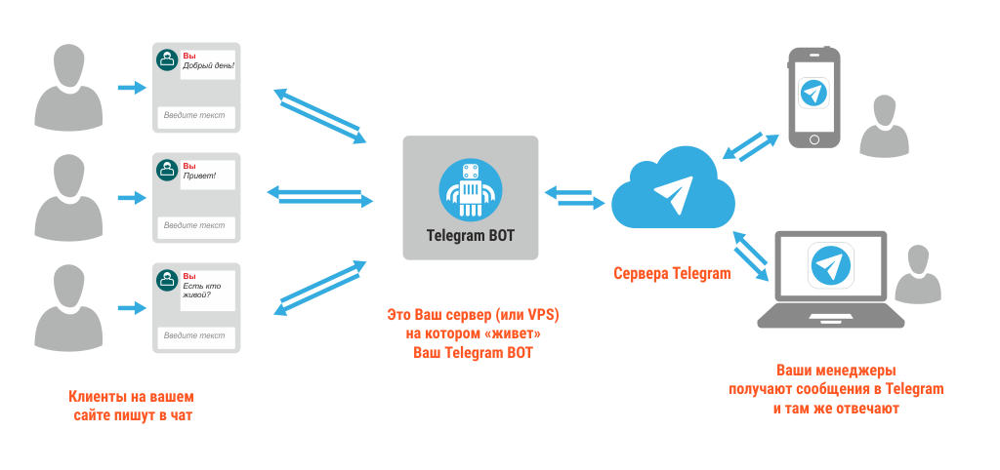
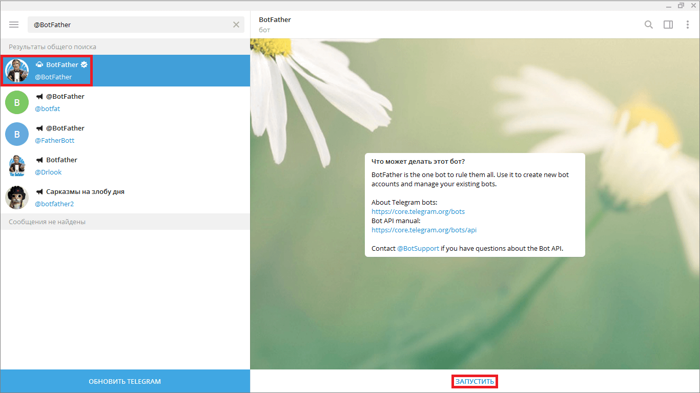
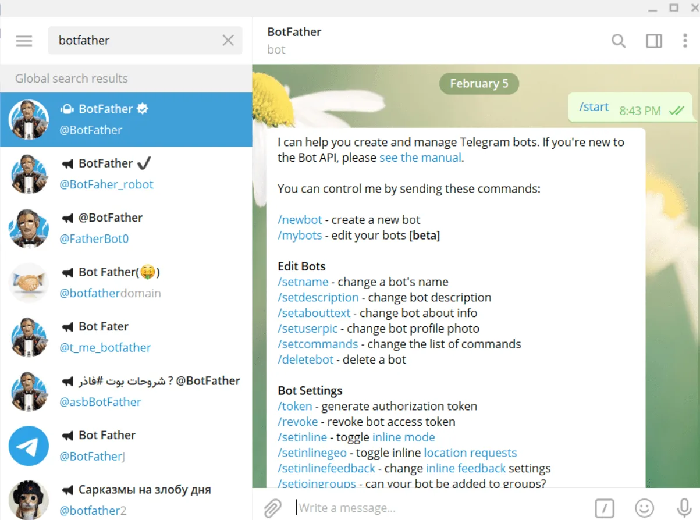
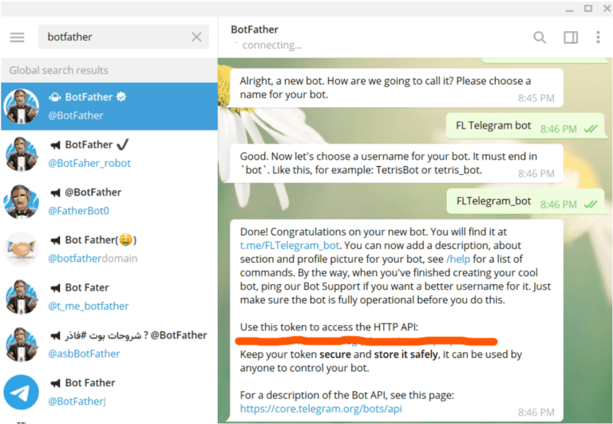

# Полное руководство по созданию Telegram-бота с Node.js и хостингом

В этом руководстве мы создадим простого Telegram-бота на Node.js с использованием **Express**, **body-parser** и **axios**, который будет работать через **Webhook**. Бот будет реагировать на слово `привет` и отвечать фразой `"вечер в хату!!"`.

---

## Что будет использоваться

| Технология       | Назначение                             |
|------------------|----------------------------------------|
| **Node.js**       | JavaScript-сервер                     |
| **Express.js**    | Обработка HTTP-запросов               |
| **body-parser**   | Парсинг JSON и form-urlencoded тел    |
| **Axios**         | Отправка HTTP-запросов к Telegram API |
| **Telegram Bot API** | Связь с Telegram                     |

---

## Схема работы бота



---

## Что будет делать бот

- Telegram отправляет сообщение боту.
- Если в сообщении есть слово `привет`, бот отвечает `"вечер в хату!!"`.
- Всё работает через **Webhook** (то есть Telegram сам отправляет сообщение на ваш сервер).

---

## Шаг 1: Получи токен Telegram-бота

1. Открой Telegram и найдите бота [`@BotFather`](https://t.me/BotFather).




2. Напиши команду `/newbot`.
3. Укажи имя и username бота.
4. Получи токен в формате:
```
123456789:ABCdefGhIJKlmNoPQRstuVWxyZ
```



Скопируй токен — он нужен для настройки Webhook.

---

## Шаг 2: Установка зависимостей

Создай папку проекта и установи зависимости:

```
mkdir telegram-webhook-bot
```
```
cd telegram-webhook-bot
```
```
npm init -y
```
```
npm install express body-parser axios
```

---

## Шаг 3: Код бота (index.js)

Создай файл `index.js` со следующим содержанием:
```
const express = require("express")
const app = express()
const bodyParser = require("body-parser")
const axios = require("axios")

const TOKEN = "ВАШ_ТОКЕН_ТУТ" // Замените на свой токен
const TELEGRAM_API = `https://api.telegram.org/bot${TOKEN}`

app.use(bodyParser.json())
app.use(bodyParser.urlencoded({ extended: true }))

app.post("/new-message", (req, res) => {
	const { message } = req.body

	if (!message || !message.text || !message.chat) {
		return res.end()
	}

	const text = message.text.toLowerCase()

	if (text.includes("привет")) {
		axios
			.post(`${TELEGRAM_API}/sendMessage`, {
				chat_id: message.chat.id,
				text: "вечер в хату!!",
			})
			.then(() => {
				console.log("Ответ отправлен")
				res.end("ok")
			})
			.catch((err) => {
				console.error("Ошибка отправки:", err)
				res.end("Ошибка: " + err)
			})
	} else {
		res.end("ok")
	}
})

app.listen(3000, () => {
	console.log("Сервер запущен на порту 3000")
})
```
---

## Шаг 4: Подключение Webhook через ngrok
Telegram требует HTTPS для Webhook, поэтому будем использовать ngrok:

1. Установи и запусти ngrok:

```
ngrok http 3000
```
2. Получи HTTPS URL, например:

```
https://abc1234.ngrok.io
```
3. Настрой Webhook:
```
curl -F "url=https://abc1234.ngrok.io/new-message" https://api.telegram.org/botВАШ_ТОКЕН_ТУТ/setWebhook
```
Если всё прошло успешно, Telegram будет отправлять сообщения на ```POST /new-message```на ваш сервер.

---

## Шаг 5: Модифицируем бота

1. Добавляем команды:
``` 
if (message.text.toLowerCase() === "/start") {
  axios.post("https://api.telegram.org/bot<TOKEN>/sendMessage", {
    chat_id: message.chat.id,
    text: "Добро пожаловать! Доступные команды:\n/help - помощь\n/joke - случайный анекдот",
    parse_mode: "Markdown"
  })
  return res.end()
}
```
2. Добавляем инлайн-клавиатуру:
```
if (message.text === "/menu") {
  axios.post("https://api.telegram.org/bot<TOKEN>/sendMessage", {
    chat_id: message.chat.id,
    text: "Выберите действие:",
    reply_markup: {
      inline_keyboard: [
        [{ text: "Кнопка 1", callback_data: "btn1" }],
        [{ text: "Кнопка 2", callback_data: "btn2" }]
      ]
    }
  })
}
```
3. Обработка callback-кнопок
```
app.post("/new-message", function(req, res) {
  if (req.body.callback_query) {
    const data = req.body.callback_query.data
    const chatId = req.body.callback_query.message.chat.id
    
    if (data === "btn1") {
      axios.post("https://api.telegram.org/bot<TOKEN>/sendMessage", {
        chat_id: chatId,
        text: "Вы нажали кнопку 1!"
      })
    }
  }
  // ... остальной код
})
```
4. Хранение состояния
```
const userStates = {}

if (message.text === "/quiz") {
  userStates[message.chat.id] = "waiting_for_answer"
  axios.post("https://api.telegram.org/bot<TOKEN>/sendMessage", {
    chat_id: message.chat.id,
    text: "Сколько будет 2+2?"
  })
}

if (userStates[message.chat.id] === "waiting_for_answer") {
  if (message.text === "4") {
    axios.post(/* сообщение о правильном ответе */)
  }
  delete userStates[message.chat.id]
}
```

---

## Завершение

Поздравляем! Теперь у тебя есть Telegram-бот на Express.js, который:

Работает на Webhook

- Хостится локально через ngrok

- Отвечает на ключевые слова и команды

Дальше ты можешь добавить:

- Интерактивные кнопки

- Ответы по шаблонам

- Сохранение истории общения

- Интеграцию с базой данных (например, SQLite или MongoDB)