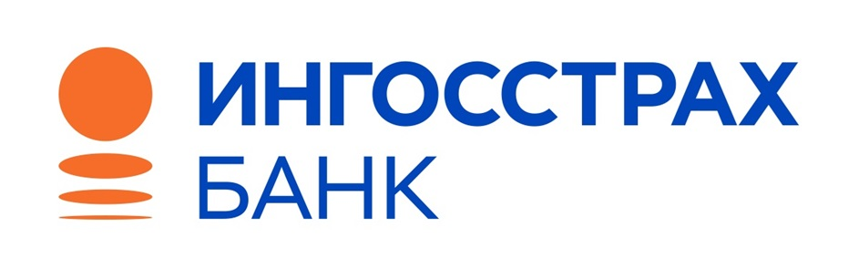

# ОТЧЁТ О ПОСЕЩЕНИИ МЕРОПРИЯТИЯ
## **«Синдром самозванца — как превратить внутреннего критика в лучшего помощника»**
### Партнёр: СПАО «Ингосстрах»

---

## Введение

В рамках нашего проекта, направленного на **исследование и развитие профессиональных и личностных компетенций выпускников**, мы приняли участие в мероприятии **«Синдром самозванца — как превратить внутреннего критика в лучшего помощника»**, организованном при поддержке **СПАО «Ингосстрах»**.

Проект, над которым мы работаем, включает в себя составление **карты компетенций выпускника**, разработку инструментов самооценки и создания личного трека развития, а также реализацию **Telegram-бота**, который помогает студентам управлять собственным ростом. Посещение мероприятия стало важным вкладом в нашу исследовательскую и проектную работу.

---

## Кто проводил встречу

Спикером выступил **руководитель Корпоративного университета компании «Ингосстрах»**, специализирующийся на адаптации молодых специалистов и развитии soft skills. Были затронуты как теоретические аспекты темы, так и реальные кейсы из практики наставничества и карьерного сопровождения.

---

## О чём шла речь

Встреча была посвящена теме **синдрома самозванца** — состоянию, знакомому многим студентам, выпускникам и молодым специалистам. Это внутренняя установка, при которой человек сомневается в своей квалификации, даже при наличии объективных достижений.

### Основные темы мероприятия:

1. **Что такое синдром самозванца**
    - Недооценка собственных успехов
    - Постоянное чувство «недостаточности»
    - Сравнение себя с другими и страх быть разоблачённым

2. **Откуда он берётся**
    - Социальное давление и завышенные ожидания
    - Перфекционизм, страх провала
    - Отсутствие привычки к рефлексии и принятию похвалы

3. **Что с этим делать**
    - Переосмысление роли внутреннего критика
    - Практики благодарности, признания достижений
    - Ведение журнала успехов
    - Постепенное расширение зоны уверенности через действие

4. **Роль работодателя и наставников**
    - Как компании могут поддержать новичков
    - Почему корпоративное сопровождение важно в первые месяцы работы
    - Кейсы Ингосстраха по менторству и развитию сотрудников

---

## Как это связано с нашим проектом

Тема мероприятия оказалась не только актуальной, но и **непосредственно связанной с нашими задачами**. Мы работаем над проектом, в котором студенту важно не только оценить свои компетенции, но и **поверить в себя**, научиться видеть рост и использовать свои сильные стороны.

| Что мы услышали и узнали                         | Как мы это применили в проекте                                     |
|--------------------------------------------------|---------------------------------------------------------------------|
| Психологическое состояние влияет на развитие     | Бот включает элементы поддержки, обратной связи и мотивации        |
| Важно видеть свои успехи                         | Мы реализовали отображение достижений и прогресса через бота       |
| Внутренний критик может быть помощником          | В логике бота заложены фразы для рефрейминга и поддержки            |
| Молодые специалисты часто сомневаются в себе     | В методике диагностики мы учли уровень уверенности и самооценки    |

---

## Telegram-бот: помощь не только в компетенциях, но и в уверенности

Одна из ключевых целей нашего проекта — это не просто техническая диагностика компетенций, а **психологическая поддержка студента на пути развития**.

После мероприятия мы внесли следующие доработки в Telegram-бота:

- Добавлены мягкие мотивационные формулировки при обратной связи
- Реализовано напоминание о пройденных шагах и достигнутом прогрессе
- Появились советы по уверенности, публичным выступлениям, принятию неудач
- Бот стал «другом», а не просто опросником

---

## Как мероприятие дополнило исследование

Мы убедились, что **психология и компетенции идут рука об руку**. Один из рисков, с которым сталкивается студент — это занижение своих возможностей и отказ от участия в проектах, стажировках или конкурсах из-за внутренней неуверенности.

Посещение мероприятия позволило нам:

- Глубже понять поведенческие аспекты развития
- Учесть влияние самооценки при составлении карт компетенций
- Сделать вывод, что поддержка в формате бота может быть не только функциональной, но и психологически значимой

---

## Общий вывод

Участие в мероприятии от **СПАО «Ингосстрах»** стало ценным и своевременным дополнением к нашей работе. Мы увидели, насколько **распространён синдром самозванца среди молодых специалистов**, и как важно учить студентов справляться с ним уже на этапе обучения.

Благодаря этой встрече мы усилили **человеческий компонент** нашего проекта, сделав упор на психологическую устойчивость, уверенность в себе и поддержку. Это мероприятие позволило нам сделать наш проект не только полезным, но и по-настоящему **человекоориентированным**.

---
