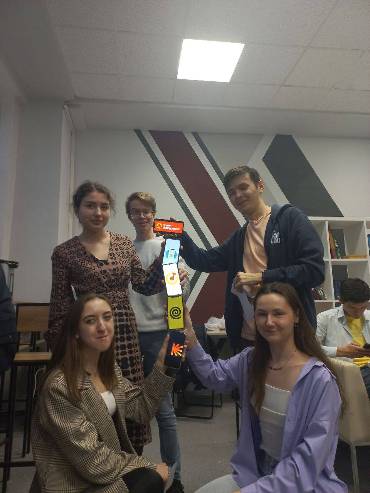

# Отчёт о посещении игровой симуляции «Путь работника Яндекса»

## Что это было?
Игровая симуляция «Путь работника Яндекса» — это интерактивный формат, в котором участники проходят путь от студента до специалиста в крупной технологической компании. Это не лекция и не тренинг, а своеобразная ролевая игра, где каждый получает уникальный маршрут с различными стартовыми условиями.

Цель мероприятия — показать участникам, как может выглядеть профессиональный путь в компании, с какими задачами и этапами можно столкнуться, начиная карьеру. Участники выполняли разнообразные игровые задания:

- составляли резюме,
- проходили собеседование,
- решали кейсы, приближённые к реальным задачам в ИТ-компании,
- взаимодействовали с другими участниками,
- получали обратную связь и поощрения за успешные действия.

При этом не требовалось быть профессиональным разработчиком или опытным аналитиком — игра была доступна и понятна студентам и начинающим специалистам.

## Что я поняла и чему научилась
Приняв участие в симуляции, я впервые оказалась "на месте" человека, который только начинает свой профессиональный путь. Это позволило взглянуть на трудоустройство не только как на формальный процесс, но как на целую систему действий, решений и компетенций, которые необходимо демонстрировать на каждом этапе.

Я научилась:

- как грамотно оформлять резюме, чтобы оно подчёркивало сильные стороны даже при минимальном опыте,
- как вести себя на собеседовании, какие вопросы задают, и что на самом деле хочет услышать работодатель,
- как решать кейсы, требующие не только знаний, но и креативного подхода,
- как работать в условиях ограниченного времени и быстро принимать решения,
- как эффективно взаимодействовать с другими участниками и представителями компании.

Этот опыт помог мне глубже понять, что от кандидатов ожидают не только конкретных знаний, но и более широких универсальных навыков, которые формируют профессиональное поведение.

## Как это связано с универсальными компетенциями
Симуляция напрямую связана с формированием универсальных компетенций, которые сегодня считаются необходимыми для успешной профессиональной и личной реализации. В рамках симуляции я на практике столкнулась с необходимостью применять и развивать все 13 универсальных компетенций:

## 1. Анализ информации
В условиях постоянного потока игровых заданий и входящей информации я научилась моментально анализировать большие объёмы данных, выделять действительно важные аспекты и отсеивать второстепенное. Особенно это пригодилось при решении кейсов, где нужно было быстро разобраться в сложной ситуации и принять обоснованное решение.

## 2. Коммуникативный и языковой навык
Игра постоянно ставила перед необходимостью чётко и ясно излагать свои мысли — будь то составление идеального резюме, прохождение собеседования или совместная работа над проектами с другими участниками. Я отточила навыки как письменной, так и устной коммуникации, научилась подбирать правильные слова в зависимости от ситуации и аудитории.

## 3. Креативность
Многие задания специально были построены так, что стандартные подходы не работали. Это заставляло мыслить нешаблонно, искать неожиданные решения и подходить к задачам под новым углом. Особенно запомнился кейс, где нужно было придумать инновационное решение для, казалось бы, рядовой проблемы.

## 4. Критическое мышление
Игра постоянно проверяла мою способность подвергать сомнению поступающую информацию. Некоторые задания содержали скрытые подвохи или избыточные данные, и нужно было проявить настоящую проницательность, чтобы отделить важное от второстепенного и прийти к верному решению.

## 5. Лидерство и наставничество
В командных заданиях мне неоднократно приходилось брать на себя роль лидера — координировать работу группы, распределять задачи и мотивировать участников. А в некоторых ситуациях, наоборот, я выступала в роли наставника, помогая менее опытным игрокам разобраться в сложных аспектах игры.

## 6. Обучаемость
Симуляция буквально погрузила меня в режим непрерывного обучения — каждый новый этап требовал освоения незнакомых инструментов и подходов. Особенно запомнился момент, когда за 20 минут пришлось разобраться в принципах A/B-тестирования и сразу применить их на практике. Это научило меня быстро впитывать новую информацию и сразу переводить знания в действия, что крайне важно в динамичной IT-среде.

## 7. Ориентация на результат
Игровая механика была построена так, что просто "участвовать" было недостаточно — нужно было добиваться конкретных измеримых результатов. Например, при разработке презентации оценивалась не только её креативность, но и чёткость ключевых метрик. Это сформировало у меня привычку всегда держать в фокусе конечную цель и выстраивать работу так, чтобы каждый шаг приближал к её достижению.

## 8. Партнёрство/сотрудничество
Самые сложные задания требовали слаженной командной работы. Один из запоминающихся моментов — когда нашей группе из четырёх незнакомых людей за 30 минут нужно было разработать стратегию вывода продукта на рынок. Пришлось быстро находить общий язык, учитывать разные точки зрения и объединять усилия для общего результата. Этот опыт показал, что настоящая синергия возникает, когда каждый вносит свой уникальный вклад.

## 9. Планирование
Ограниченное время игры (всего 4 часа на все этапы) заставило по-настоящему ценить каждую минуту. Я научилась составлять гибкие планы с приоритетами — например, сначала пройти обязательные этапы собеседования, параллельно отвечая на простые задания в чате, а сложные аналитические кейсы оставить на конец, когда появится больше информации. Этот навык стратегического распределения времени оказался бесценным.

## 10. Самоорганизация
При одновременном выполнении множества задач (отслеживание дедлайнов, контроль выполнения поручений, ведение переговоров) я выработала свою систему организации работы. Например, начала использовать цветные метки для разных типов заданий и установила личные мини-дедлайны, которые на 15 минут опережали игровые. Это помогло не просто успевать, но и оставаться на шаг впереди.

## 11. Саморазвитие
После каждого игрового дня я проводила детальный разбор своих действий — какие решения привели к успеху, где были ошибки, что можно улучшить. Особенно полезным оказался анализ фидбэка от кураторов: даже положительные оценки содержали ценные рекомендации для роста. Это сформировало привычку к постоянной рефлексии и осознанному профессиональному развитию.

## 12. Системное мышление
Самые интересные задания требовали видеть картину целиком. Например, при оптимизации рабочего процесса нужно было учитывать не только скорость выполнения задач, но и нагрузку на сотрудников, качество результата и долгосрочные последствия изменений. Это научило меня рассматривать любую проблему комплексно, учитывая все взаимосвязи и возможные последствия.

## 13. Стрессоустойчивость
Искусственно созданные стрессовые ситуации (внезапные изменения условий, ограничение времени, "горящие" дедлайны) стали отличной тренировкой эмоционального интеллекта. Особенно запомнился момент, когда за 5 минут до окончания игры внезапно изменились требования к проекту — пришлось мгновенно перестраиваться, сохраняя хладнокровие. Этот опыт показал, что даже в условиях цейтнота можно находить оптимальные решения.

## Вывод
Игровая симуляция «Путь работника Яндекса» оказалась не просто интересной и увлекательной, но и по-настоящему полезной. Она помогла мне посмотреть на процесс трудоустройства глазами работодателя и понять, что сегодня важно не только "уметь", но и уметь действовать — в команде, в условиях неопределённости, в цифровом пространстве.

Особенно ценным стало осознание того, что именно универсальные компетенции лежат в основе профессионального успеха. Они применимы в любой сфере, особенно на старте карьеры, и именно их развитие делает из студента — специалиста. Участие в симуляции помогло мне осознать свой текущий уровень этих компетенций и определить направления для дальнейшего развития.

## Кто посещал?

Бензая Яна Семеновна 241-362